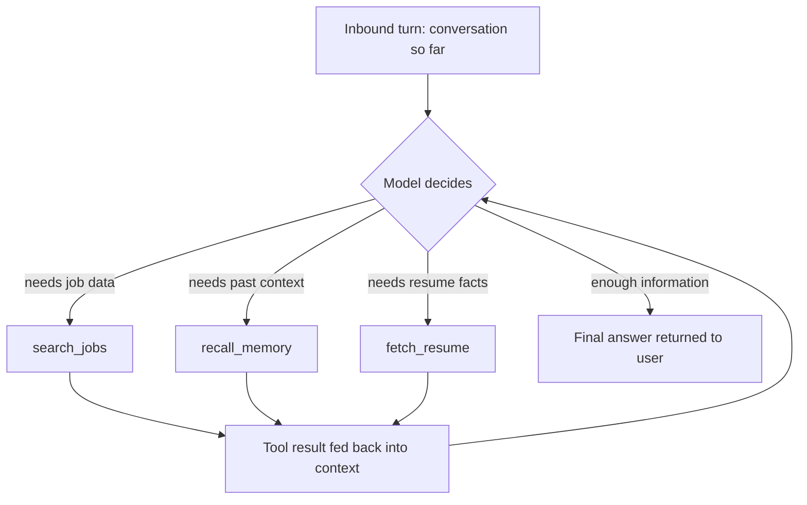
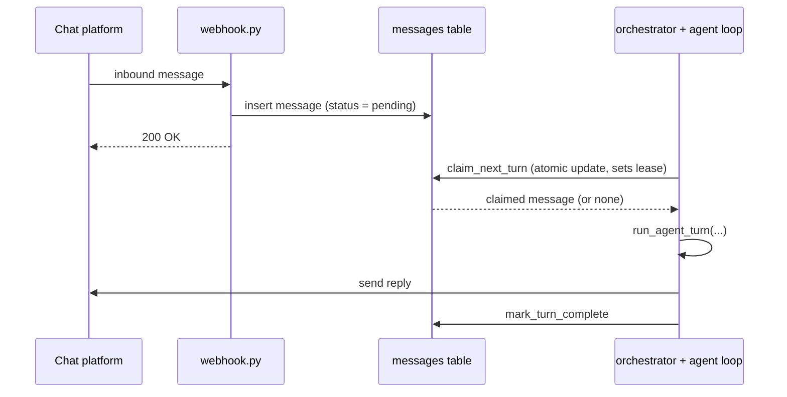
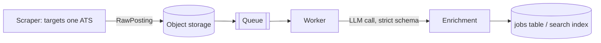

# Architecture

This document walks through the ideas the JobPilot demo code is
structured around. It's the "why" to go with the code's "what".

Reminder: none of this runs. Every diagram below describes intended
behavior that the corresponding module stubs out.

## 1. The agent loop

A plain chatbot generates a reply from the conversation directly. An
*agentic* one is given tools and decides for itself, turn by turn,
whether it has enough information to answer or needs to call
something first — and if so, which thing.

The loop is capped at a small fixed number of tool calls
(`MAX_TOOL_STEPS` in `agent/loop.py`) so a model that never decides
it's satisfied can't spin forever. See `agent/loop.py` and
`agent/tools.py`.

## 2. Durable turns and claim-and-lease

An inbound message is written to the database as the very first step,
before any processing. That means a crash between "message received"
and "reply sent" loses nothing — the message is sitting in the
database, still marked pending, waiting to be picked up again.

Running more than one worker introduces a new problem: two workers
could both grab the same pending message and both reply. The
claim-and-lease pattern (`chat/orchestrator.py`) avoids that with a
single atomic update per claim, rather than a separate lock service.

If a worker crashes mid-turn, its lease simply expires and
`release_expired_leases` makes the message claimable again — no
message is lost, and no message gets two replies while a live lease
holds.

## 3. Long-term memory

A background step (not modeled as its own module here, but implied by
`user_memory_facts` in `db/schema.sql`) periodically reads through
recent conversation history for a user and extracts durable facts —
things like stated preferences or experience level, not one-off
details from a single message. Later turns retrieve these facts by
meaning via `agent/tools.py::recall_memory`, the same way job search
retrieves postings by meaning.

## 4. Ingestion pipeline

Scrapers target applicant tracking systems (the hiring software many
employers share to post and manage job openings), not individual
companies. One scraper written against one ATS reaches every employer
using that ATS, instead of needing a new scraper every time a new
company needs covering.

The queue is what decouples collection from processing: a scraper can
run on its own schedule without waiting for anything downstream, and
workers can consume (and scale up or down) independently of how fast
scraping happens. See `ingest/scrapers/base.py`, `ingest/queue.py`,
`ingest/worker.py`.

## 5. Enrichment and the taxonomy

A scraped posting is messy human prose. The enrichment step
(`ingest/enrich.py`) sends that text to an LLM along with a fixed
schema and asks for a structured record: role category, seniority
band, skills, location, pay, and a scam-risk flag with a reason.

This demo invents its own small taxonomy purely for illustration:

- **Role categories (6):** engineering, data_and_analytics, design,
  sales_and_marketing, operations, customer_support
- **Seniority bands (4):** entry, junior, mid, senior

A real system would validate every enriched record against a taxonomy
like this and reject or flag anything that doesn't fit, rather than
silently letting free-form values into the database.

## 6. The matching idea: describe the candidate, not the job

This is the most interesting idea in the project, so it's worth
spelling out clearly.

The obvious approach to job matching is: embed the job description,
embed the person's resume or a query they typed, and compare the two
vectors. In practice this doesn't work as well as it sounds — job
descriptions and resumes are written in different registers, for
different audiences, and often don't share much vocabulary even when
the job is a great fit.

Instead, this project has the model write a short description of the
*ideal candidate* for a job — company name and location stripped out
— phrased the way a person might describe themselves ("a few years
into backend work, comfortable owning a service end to end..."). That
description is what gets embedded and indexed, not the raw posting
text. When a job seeker's own self-description ("I've been doing
backend work for a few years and like owning things end to end") gets
embedded and compared, it's now person-description against
person-description, in the same register, which matches noticeably
better than posting-against-resume.

See `agent/prompts.py::IDEAL_CANDIDATE_PROMPT` and
`search/embed.py`.

## 7. Hybrid search

Semantic similarity alone can surface a posting that reads similarly
but is years too senior or on the wrong continent. Structured filters
alone can hand back a pile of technically-matching postings that have
nothing to do with what someone's actually looking for. `search/hybrid.py`
gathers semantic candidates and narrows them by structured filters
(years of experience, city, role category); `search/ranking.py` orders
what's left. Neither module works well without the other.
